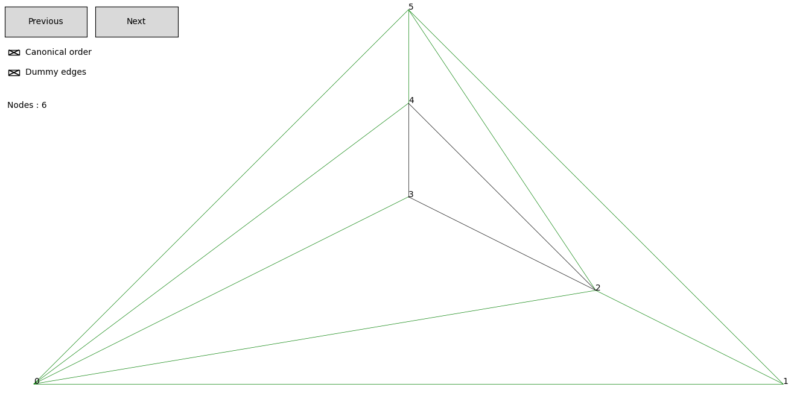
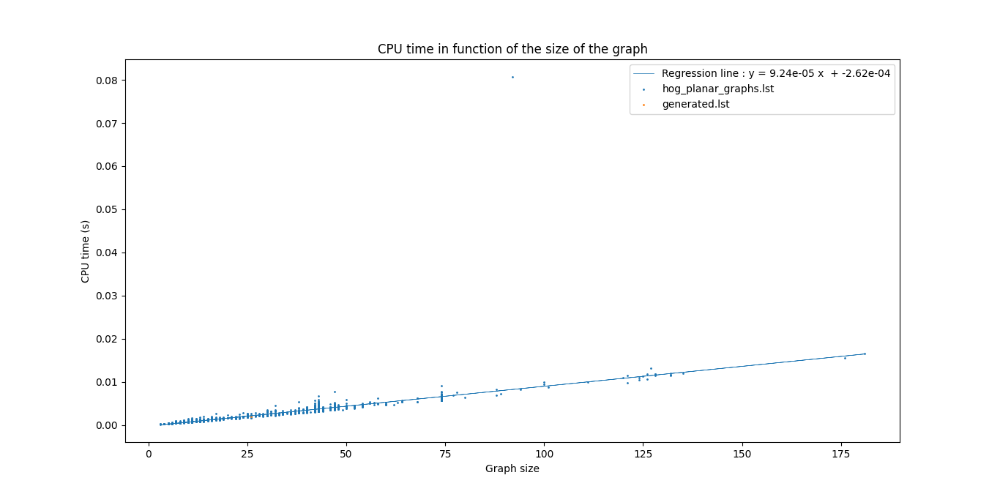

# Dessin en lignes droites de graphes planaires sur une grille
Implémentation Python d'un algorithme de dessin de graphe planaire proposé par de Fraysseix [1]. Cet algorithme, basé sur l'ordre canonique, prend en entrée un graphe planaire triangulé et retourne une liste associant chaque sommet à sa position sur une grille.

---

[1] Hubert de Fraysseix, János Pach, and Richard Pollack. How to draw a planar graph on a grid. *Combinatorica*, 10(1) :41–51, 1990.

## Guide d'utilisation

### Librairies nécessaires

- *networkx* 
- *matplotlib*
- *numpy*

### Dessin de graphe sur une grille

Ouvre une fenêtre matplotlib affichant le dessin d'un graphe de la liste spécifiée. Des boutons permettent de changer le graphe affiché. Il est possible d'afficher les arêtes ajoutées pour trianguler le graphe ("dummy edges") ainsi que l’étiquetage des sommets correspondant à l'ordre canonique utilisé pour construire le dessin.

```
python main.py [-h] [-m MIN] [-M MAX] [-t] files [files ...]
```
       
Les différentes arguments sont les suivants:
- arguments positionnels:
  - files : spécifie les différents fichiers contenant les graphes qui seront traités. Si des graphes non-planaires sont trouvés, ils seront ignorés. Les fichiers doivent donner les graphes sous forme de listes d'adjacences. Chaque ligne donne les voisins d'un sommet sous la forme x: a b c où a,b et c sont les voisins de x. Une ligne vide sépare les différents graphe. Le répertoire *graph_examples* contient différents exemples de fichier respectant ce formalisme. 
- arguments optionnels:
  - -h, --help : affiche l'aide.
  -  -m MIN, --min MIN : spécifie la taille minimale des graphes traités. Les graphes comptant trop peu de sommets sont ignorés.
  - -M MAX, --max MAX : spécifie la taille maximale des graphes traités. Les graphes trop grands sont ignorés.
  - -t, --tk : si spécifié, les graphes seront dessinés directement sur un canvas *tkinter* plutôt que dans une fenêtre matplotlib. Les dessins produits sont moins jolis et il n'est pas possible de ne pas afficher les "dummy edges", l'intention était de n'utiliser que matplotlib. Mais cette solution s'avérant beaucoup plus rapide, il est possible de l'utiliser via cette option.

Voici un exemple d'affichage de graphe:


### Mesure du temps nécessaire à calculer le dessin

Le script *measure_time.py* mesure le temps nécessaire à calculer le dessin planaires des graphes spécifiés et porte les résultats en graphique. Pour chaque graphe, le temps mesuré désigne le temps nécessaire pour les étapes de : calcul d'un ordre canonique et shift-algorithm. Le temps est mesuré à l'aide de la librairie *timeit*.

```
python measure_time.py [-h] [-m MIN] [-M MAX] [--repeat REPEAT] [-r] [-t] files [files ...]
```

Les différentes arguments sont les suivants:
- arguments positionnels:
  - files : spécifie les différents fichiers contenant les graphes qui seront traités. Si des graphes non-planaires sont trouvés, ils seront ignorés.
- arguments optionnels:
  - -h, --help : affiche l'aide.
  -  -m MIN, --min MIN : spécifie la taille minimale des graphes traités. Les graphes comptant trop peu de sommets sont ignorés.
  - -M MAX, --max MAX : spécifie la taille maximale des graphes traités. Les graphes trop grands sont ignorés.
  - \-\-repeat REPEAT : spécifie le nombre de mesures opérées sur chaque graphe. La mesure du temps affichée sera la moyenne des temps observés.
  - -r, --regression  : si spécifié, une droite de régression est affichée.
  - -t, --triangulation : si spécifié, le temps de triangulation est compté dans les mesures.


Voici un exemple de graphique obtenu:


